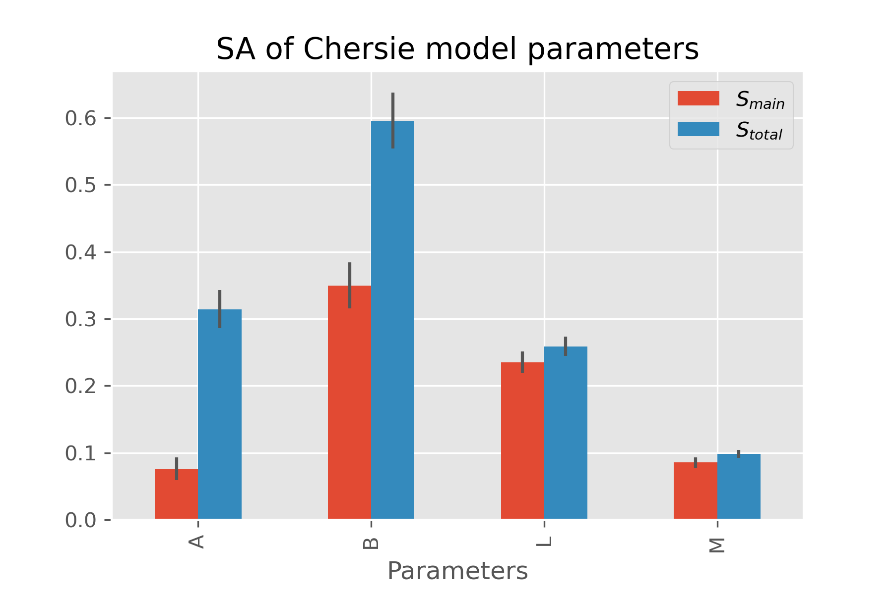

# Project UQ and SA
Project of course Geostatistics and Reservoir Simulations - Skoltech - 2021

> Multi-objective approach to optimize irrigation using a crop simulation model and historical weather data.

Computational implementation of the Buckley-Leverett (BL) model of water-oil displacement in a petroleum reservoir with the additional implementation of the two different relative permeability models – Chierici\`s (Chieici, 1984, 1994) and LET (Lomeland et al., 2005), which are depending on parameters B,M,A,L and L,E,T consequently. Sensitivity analysis of the result values of BL model -relative permeability crossing points, shock font saturation and displaced oil at a fixed time, depending on  B,M,A,L and L,E,T parameters was performed by Sobol indices SA in SAlib open source python library.

	
	 

## Google Colab 

How to run example SA in Google Colab 

Open `SA_for_relative_permeability_models_of_2_phase_flow.ipynb` in Google Colab!

## Dependencies 

**SALib** - Python implementations of commonly used sensitivity analysis methods, including Sobol, Morris, and FAST methods. Useful in systems modeling to calculate the effects of model inputs or exogenous factors on outputs of interest.

https://salib.readthedocs.io/en/latest/

## Installation

Clone this repository and create new `conda env` on your local machine

`git clone https://github.com/ABAZH666/project_uq_and_sa.git`

Create new env with for project

`conda env create -f geostat.yml`

`conda activate geostat`

## Meta

Alina Bazhanova – Alina.Bazhanova@skoltech.ru

## License

Distributed under the Creative Commons Zero v1.0 Universal license. See ``LICENSE`` for more information.
